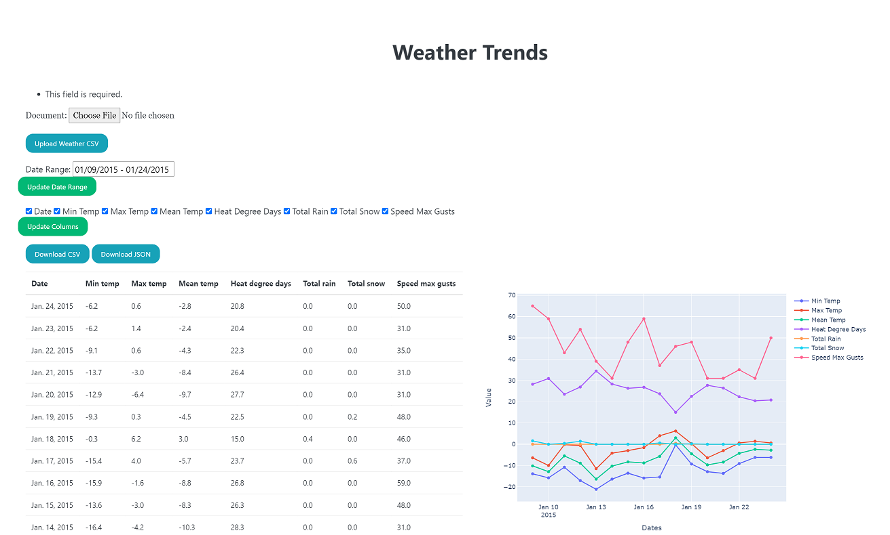
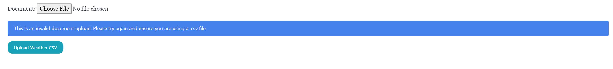

# WeatherAnalyzer
A simple weather data viewing tool

# Versions
* Django 3.x
* Python 3.x

# Key Python libraries
* django_tables2
* plotly

# Front-End Functionality
## Upload CSV file
* Files from [weather website](https://climate.weather.gc.ca/climate_data/daily_data_e.html?StationID=51459) accepted
* File Validation - Return Error Message Specifying Issue
  * Check file extension
  * Check number of columns
  * Check column titles
Example:

  
## Date Picker
* On Upload
  * Load to date range of data available in the CSV
* On Change
  * Update table and graph data to represent selected date range
  
## Table
* Select/Deselect Checkboxes
  * "Update Columns" updates the table data to represent selected checkboxes only

## Graph
* Select/Deselect Lines
  * Graph adds/removes appropriate lines
  
## Export CSV/JSON
* Downloads CSV/JSON file with current table values

# Back-End Functionality

* Create models from uploaded files
  * Each row of data is an object under the parent file
  * Filter data to return specific date range data
* 
